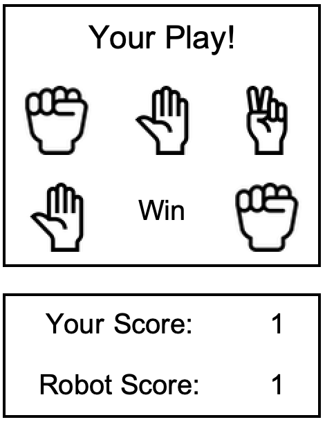

## Introduction

In this project, you will create a game of Rock-Paper-Scissors to play against the computer.

### What you will make

--- collapse ---
---
title: What you will need
---
### Hardware

+ A computer: desktop, laptop, or a Raspberry Pi

### Software

+ Wolfram Language, available for free on the Raspberry Pi as part of the official operating system, Raspbian

--- /collapse ---

--- collapse ---
---
title: What you will learn
---

+ How to work with variables and images
+ How to work with `Dynamic` values in Wolfram
+ How to create interactive buttons in Wolfram
+ How to design user interfaces in Wolfram

--- /collapse ---

--- collapse ---
---
title: Additional information for educators
---

If you need to print this project, please use the [printer-friendly version](https://projects.raspberrypi.org/en/projects/project-name/print){:target="_blank"}.

[Here is a link to the resources for this project](http://rpf.io/project-name-go).

--- /collapse ---
