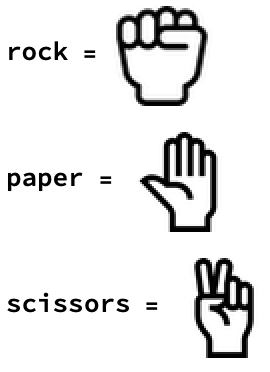

## Building Blocks of the Game

In Rock, Paper, Scissors, two players (in this case, the user and the computer), each select one of the three play options: "Rock", "Paper", or "Scissors".

"Rock" wins against "Scissors", "Scissors" wins against "Paper", and "Paper" wins against "Rock". If both players play the same option, then it's a tie.

First, we will create three buttons for the user to press in order to choose their play option. Each time the user chooses a new option, we will set the computer's play option to be a random choice between the three options.

---task---
Copy and paste these images into your notebook, and give them the variable names `rock`, `paper`, and `scissors`.


Your code should look like this:



---/task---

We want the computer to randomly select one of the three options each time we play. We can accomplish this using `RandomChoice`. `RandomChoice` takes one argument: a list of the possible choices.

---task---
Create a variable `robot`, which is a random choice of the three options.

```
robot = RandomChoice[{rock, paper, scissors}]
```

Try evaluating this code a few times to check that you get a different random result each time.

---/task---

---task---

Create a variable, `human`, which at the moment will be `rock`, but will be updated to be the user's choice.

```
human = rock
```

---/task---

We want the user to be able to select their play option using buttons.

Each time the user presses the button, we want to update the varaible `human` with their choice, and update the varaible `robot` with another random selection.

---task---
Create buttons for `rock`, `paper`, and `scissors`. Each button should update the `human` variable to the value of the button, and should update the `robot` variable to another random selection.

You can make a button do multiple actions by separating the actions with a `;`.

```
Button[rock, human = rock; robot = RandomChoice[{rock, paper, scissors}]]
Button[paper, human = paper; robot = RandomChoice[{rock, paper, scissors}]]
Button[scissors, human = scissors; robot = RandomChoice[{rock, paper, scissors}]]
```

--- /task ---

You will notice that every time you press the button, there is no output. This is becuase the variables `human` and `robot` need to be evaluated again each time you press the button in order to show the result. It would be better to have the new output show automatically when you press the button.

We can do this using `Dynamic`. `Dynamic` displays the updated value, so each time we reevaluate the code by pressing the button, `Dynamic` will update to the new value.

---task---
Add `Dynamic` results for the variables `human` and `robot` to show the new outputs each time we press the buttons.

```
Button[rock, human = rock; robot = RandomChoice[{rock, paper, scissors}]]
Button[paper, human = paper; robot = RandomChoice[{rock, paper, scissors}]]
Button[scissors, human = scissors; robot = RandomChoice[{rock, paper, scissors}]]
Dynamic[human]
Dynamic[robot]

```
---/task---
