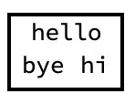

## Building an Interface

One design decision we can make for this project is removing the frames on buttons. The button acts in exactly the same way, it just doesn't have a frame around it.

```Button[rock, Appearance -> None]```


--- task ---

Add `Appearance -> None` to each `Button`.

For example, the code for `rock` button should now be:

```
Button[rock,
 human = rock;
 robot = RandomChoice[{rock, paper, scissors}];
 results =
  Which[
   robot == rock, "Tie",
   robot == paper, robotScore += 1; "Lose",
   robot == scissors, humanScore += 1; "Win"], Appearance -> None
 ]
 
 ```
 Do this for all three of your buttons.
 
 --- /task ---

We can also use `Grid` to build a nice interface.

Let's take a look at an example of `Grid`.

```
Grid[{{"hello", "goodbye"}, {"bye", "hi"}}]
```


As you can see, a `Grid` is a list of lists. Each list becomes a row in the `Grid`.

We can span certain elements across the grid using `SpanFromLeft`.

```
Grid[{{"hello", SpanFromLeft}, {"bye", "hi"}}]
```


We can draw a frame around the outside using `Frame -> True`, and we can make the frame thick by using `FrameStyle -> Thick`.

```
Grid[{{"hello", SpanFromLeft}, {"bye", "hi"}}, Frame -> True, FrameStyle -> Thick]
```


We can also add extra space inside the `Grid` using `Spacings`.`Spacings` takes two dimensions: horizontal and vertical, in a list. The horizontal number makes each column in the grid a certain width. The vertical number makes each row in the grid a certain height.

```
Grid[{{"hello", SpanFromLeft}, {"bye", "hi"}}, Frame -> True, 
 FrameStyle -> Thick, Spacings -> {4, 2}]
 ```

 
 
 We are going to make two `Grid`s. The first `Grid` will have:
+ a title
+ the three buttons: `rock`, `paper`, and `scissors`, for the user to choose their play
+ the `human` choice, the result, and the `robot` choice

The second `Grid` will have:
+ The `humanScore`
+ The `robotScore`
 
 ---task ---
 
 Build a `Grid` with three rows.
 
 + The first row should contain a title, which you can customise using `Style[Text["title"]]`. Because the second and third row have three elements, we can centre the title by using `SpanFromLeft` twice.
 + The second row should be the three buttons.
 + The third row should be `Dynamic[human]`, `Dynamic[result]`, and `Dynamic[robot]`.
 
 Use `Frame -> True` to add a `Frame`, and make the `Frame` thick using `FrameStyle -> Thick`.
 Use `Spacings` to add extra space inside the `Grid`. This `Grid` should have `Spacings -> {2, 1.5}`, so that it matches with the second `Grid`.
 
 ```
 Grid[{
  {Style[Text["Your Play!"], 23], SpanFromLeft, SpanFromLeft},
  {Button[rock,
    human = rock;
    robot = RandomChoice[{rock, paper, scissors}];
    results =
     Which[
      robot == rock, "Tie",
      robot == paper, robotScore += 1; "Lose",
      robot == scissors, humanScore += 1; "Win"], Appearance -> None
    ],
   Button[paper,
    human = paper;
    robot = RandomChoice[{rock, paper, scissors}];
    results =
     Which[
      robot == paper, "Tie",
       robot == scissors, robotScore += 1; "Lose",
       robot == rock, humanScore += 1; "Win"], Appearance -> None
    ],
   Button[scissors,
    human = scissors;
    robot = RandomChoice[{rock, paper, scissors}];
    results =
     Which[
      robot == scissors, "Tie",
      robot == rock, robotScore += 1; "Lose",
      robot == paper, humanScore += 1; "Win"], Appearance -> None
    ]},
  {Dynamic[human], Dynamic[Style[Text[results], 20]], Dynamic[robot]}
  }, Frame -> True, FrameStyle -> Thick, Spacings -> {2, 1.5}]
  ```
  

 
 ---/task---
 
 --- task---
 Build a second `Grid` with two rows to show the scores.
 
 + The first row should contain text "Your Score", and the `humanScore`
 + The second row should contain text "Robot Score", and the `robotScore`
 
 Use `Frame -> True` to add a `Frame`, and make the `Frame` thick using `FrameStyle -> Thick`.
  Use `Spacings` to add extra space inside the `Grid`. This `Grid` should have `Spacings -> {3.85, 1.5}`, so that it matches with the first `Grid`. The `Spacings` for this `Grid` are larger because the items in this `Grid` are smaller.
 
 ```
Grid[{
  {Style[Text["Your Score:"], 20],Dynamic[Style[Text[humanScore], 20]]},
  {Style[Text["Robot Score:"], 20], Dynamic[Style[Text[robotScore], 20]]}
  }, Frame -> True, FrameStyle -> Thick, Spacings -> {3.85, 1.5}]
  
  ```
 ---/task---
 
Excellent. Now you have a play interface, and a results section! Your game is now fully functioning. Play the game, and see if you can beat the computer!
 
 
